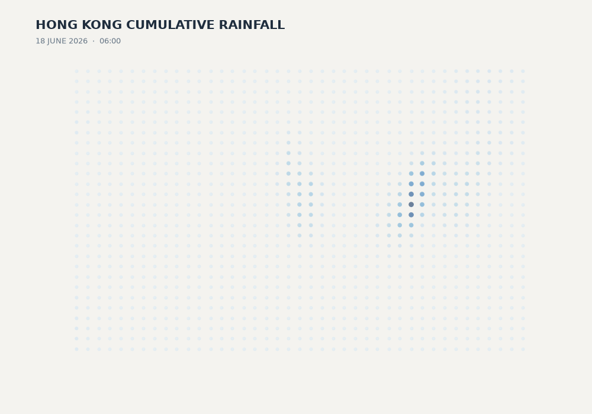

# The phenomenon

Hong Kong Rainfall on 18 June 2026 6:00-12:00



## The phenomenon

On 18 June 2026, a heavy rainstorm affected Hong Kong. I was interested in how the predicted rainfall pattern changed across different locations and over time. Instead of showing rainfall as a conventional weather map, I wanted to visualize the accumulation of forecast rainfall as a growing spatial pattern. I focused on the period from 06:00 to 12:00, using one frame every 30 minutes.

## The source

The data comes from the Hong Kong Observatory's Gridded Rainfall Nowcast dataset:
https://data.gov.hk/en-data/dataset/hko-gridded-rainfall-nowcast

## What the picture shows

The visualization represents each spatial location as a particle. Higher cumulative forecast rainfall is shown by larger and darker particles, so the pattern gradually builds from 06:00 to 12:00. The visualization hides the original four forecast periods at each location and does not show geographic boundaries, roads, or other map information. It therefore emphasizes the spatial accumulation pattern rather than precise geographic reference or individual forecast values.

## Run it

```
uv run fetch.py
uv run plot.py
```
